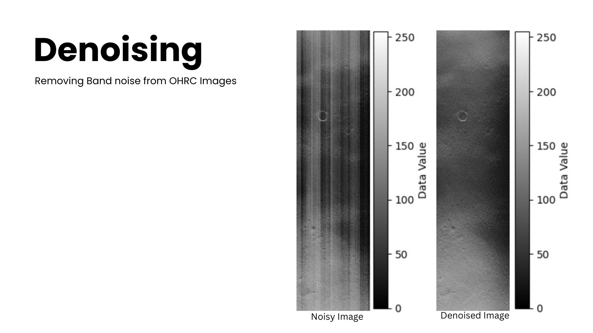

# SIH 2024 - Space Penguins

## Enhancement of Permanently Shadowed Regions (PSR) of Lunar Craters Captured by OHRC of Chandrayaan-2

### What are PSRs?
Permanently Shadowed Regions (PSRs) are areas near the Moon's poles that remain in perpetual darkness due to the Moon's small axial tilt (1.54°). These regions are among the coldest places in the solar system, with temperatures as low as 40 K (-233°C), and they likely contain ancient water ice and other volatiles trapped for billions of years.

### Why is PSR Enhancement Important?
- Enables the creation of a **PSR image map** using OHRC images from Chandrayaan-2.
- Supports **landing site selection** by identifying stable and scientifically significant areas.
- Addresses **noise issues** in PSR images, including:
  - **Banding noise:** Introduced by the camera sensor during image capture.
  - **Graininess (Speckle noise):** Caused by low photon availability in PSRs.

## Image Denoising and Enhancement

### Chosen Approach:
Our approach focuses on removing band noise and speckle noise using:
- **Banding Noise Removal:** Discrete Wavelet Transform (DWT) and Fast Fourier Transform (FFT).
- **Speckle Noise Reduction:** Gamma Correction, Contrast Limited Adaptive Histogram Equalization (CLAHE), and Unsharp Masking.

### Attempted Approaches:
- **Traditional Methods:** CLAHE + Gamma Correction
- **Deep Learning-Based Methods:** CNN + CLAHE + Retinex
- **Hybrid Approaches:** Combination of traditional and deep learning methods

.jpg)

.jpg)

## Performance Metrics
- **Structural Similarity Index (SSIM):** 0.98
- **Coefficient of Determination (R-squared):** 0.90
- **Signal-to-Noise Ratio (SNR):**
  - Input Image: 10.93
  - Denoised Image: 11.45

## Results
The proposed enhancement methods significantly improve the visibility and quality of PSR images, making them more suitable for scientific analysis, lunar terrain mapping, and mission planning.

## Contributors
Team Space Penguins - SIH 2024

